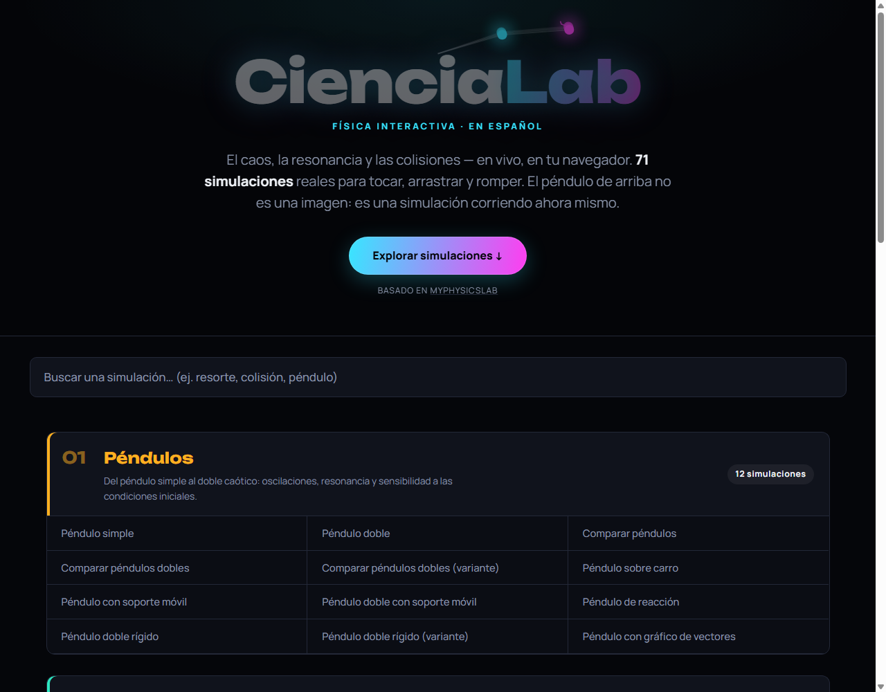

# CienciaLab

**Un laboratorio de física interactivo, completamente en español.**



🔗 **Sitio en vivo:** <https://cyberdark-security.github.io/CienciaLab/>

---

## Qué es esto

CienciaLab es una traducción y curaduría al español de **[myPhysicsLab](https://www.myphysicslab.com)**,
una librería de simulaciones de física interactivas en tiempo real creada originalmente
por Erik Neumann. Cada simulación corre directamente en el navegador (sin backend, sin
servidor) y se puede manipular en vivo: arrastra, suelta, cambia masas, resortes,
gravedad, amortiguación y más.

66 simulaciones, organizadas en 6 categorías:

| Categoría | Contenido |
|---|---|
| **Péndulos** | Del péndulo simple al doble caótico |
| **Resortes y Osciladores** | Masas, resortes y moléculas |
| **Colisiones y Cuerpos Rígidos** | Billar, engranajes, cunas de Newton, física de contacto |
| **Movimiento en Rampas y Curvas** | Trayectorias curvas, energía y la curva braquistócrona |
| **Ecuaciones Diferenciales** | La cuerda vibrante como ecuación de onda |
| **Experimental y Miscelánea** | Calculadoras gráficas, ruedas magnéticas y más |

El sitio se publica automáticamente en GitHub Pages mediante GitHub Actions cada vez que
se sube un cambio a `master` — todo gratis, sin infraestructura propia.

## Créditos y licencia

Todo el mérito del motor de física, las simulaciones y la arquitectura original es de
**Erik Neumann** y el proyecto myPhysicsLab (<https://github.com/myphysicslab/myphysicslab>).
Este repositorio es un trabajo derivado bajo la [licencia Apache 2.0](LICENSE) — ver
también el archivo [NOTICE](NOTICE).

Las modificaciones respecto al original: traducción completa de la interfaz al español,
un dashboard/página de inicio propio, y el proceso de publicación en GitHub Pages.

## Compilar localmente

Requiere [Node.js](https://nodejs.org) (para TypeScript y esbuild), [Perl](https://www.perl.org)
y [GNU Make](https://www.gnu.org/software/make/).

```bash
npm install --no-save typescript esbuild
ln -s node_modules/esbuild/bin/esbuild esbuild
node_modules/.bin/tsc
make
```

Esto genera el sitio completo (solo en español) dentro de `build/`. Abre
`build/index.html` en un navegador para verlo.

&nbsp;
